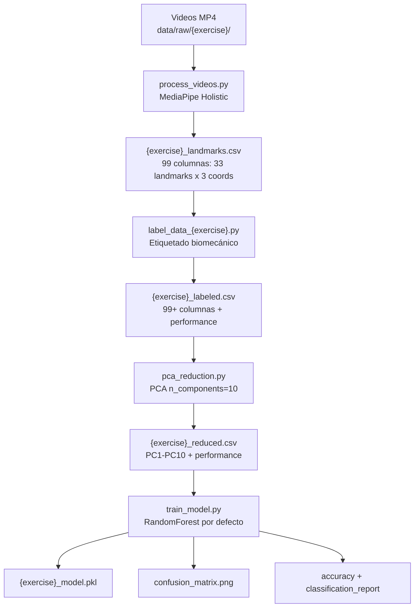
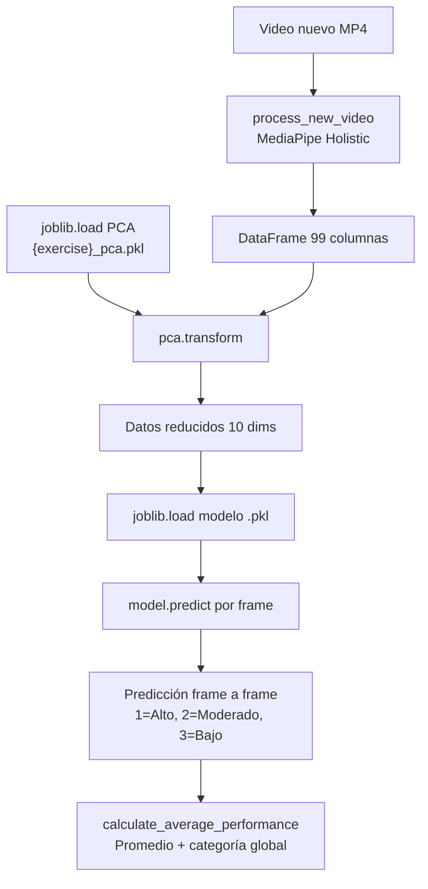

# AGENTS.md — Guía Técnica del Proyecto

## 1. Descripción General

Sistema de visión por computadora para la **evaluación automatizada de habilidades motoras gruesas** en niños con síndrome de Down. El sistema graba ejercicios en video, extrae puntos clave del cuerpo (pose landmarks) mediante MediaPipe, etiqueta el rendimiento con criterios biomecánicos específicos por ejercicio, reduce la dimensionalidad con PCA y clasifica el rendimiento en tres niveles (Alto, Moderado, Bajo) con modelos de Machine Learning.

**Dominio:** Terapia ocupacional / fisioterapia infantil asistida por IA.

**Ejercicios soportados:**

| ID interno | Ejercicio | Descripción |
|------------|-----------|-------------|
| `jump` | Salto | Evaluación de la altura y control del salto vertical |
| `crawl` | Gateo | Evaluación de coordinación, estabilidad y fluidez al gatear |
| `sit` | Sentarse/levantarse | Evaluación de postura, simetría y suavidad en transiciones |
| `throw` | Lanzamiento de pelota | Evaluación de secuencia cinemática, amplitud y estabilidad postural |

---

## 2. Stack Tecnológico y Dependencias

Todas las dependencias se instalan con `pip install -r requirements.txt`.

| Paquete | Versión | Propósito | Archivos donde se usa |
|---------|---------|-----------|----------------------|
| `mediapipe` | 0.10.5 | Detección de pose con el modelo Holistic (33 landmarks por frame) | `process_videos.py`, `predict_performance.py`, `Landmarks/main.py` |
| `opencv-contrib-python` | latest | Lectura de video frame a frame, conversión de color BGR→RGB | `process_videos.py`, `predict_performance.py`, `Landmarks/main.py` |
| `pandas` | latest | Manipulación de DataFrames, lectura/escritura de CSV | Todos los módulos |
| `numpy` | latest | Cálculos numéricos: ángulos, correlaciones, percentiles, suavizado | `label_data_crawl.py`, `label_data_sit.py`, `label_data_throw.py` |
| `scikit-learn` | latest | PCA, modelos de clasificación (RF, GBM, SVM, LR, kNN), métricas, train/test split | `pca_reduction.py`, `train_model.py` |
| `joblib` | latest | Serialización/deserialización de modelos y objetos PCA (`.pkl`) | `pca_reduction.py`, `train_model.py`, `predict_performance.py` |
| `matplotlib` | latest | Generación de gráficos (matrices de confusión) | `train_model.py` |
| `seaborn` | latest | Heatmaps para visualización de matrices de confusión | `train_model.py` |

**Dependencias adicionales no listadas en requirements.txt** (usadas solo en tests):
- `pytest` — framework de testing
- `memory_profiler` — perfilado de memoria en tests de rendimiento

---

## 3. Estructura del Proyecto

```
proyectoTesis/
├── AGENTS.md                          # Esta guía técnica
├── README.md                          # Documentación general del proyecto
├── requirements.txt                   # Dependencias Python
├── .gitignore                         # Archivos ignorados por Git
├── landmarks_output.csv               # Salida del módulo Landmarks (auxiliar)
│
├── Landmarks/                         # Módulo auxiliar de visualización
│   ├── main.py                        # Script de visualización de landmarks en video
│   └── extract_landmarks.py           # Extracción de landmarks a CSV (modo append)
│
├── src/
│   ├── training/                      # Pipeline de entrenamiento
│   │   ├── main_training.py           # Orquestador del pipeline completo
│   │   ├── process_videos.py          # Extracción de landmarks desde videos
│   │   ├── label_data_jump.py         # Etiquetado biomecánico: salto
│   │   ├── label_data_crawl.py        # Etiquetado biomecánico: gateo
│   │   ├── label_data_sit.py          # Etiquetado biomecánico: sentarse
│   │   ├── label_data_throw.py        # Etiquetado biomecánico: lanzamiento
│   │   ├── pca_reduction.py           # Reducción de dimensionalidad (PCA)
│   │   ├── train_model.py             # Entrenamiento, evaluación y guardado de modelos
│   │   └── compare_models.py          # Comparación de múltiples algoritmos
│   │
│   └── evaluation/                    # Pipeline de evaluación/inferencia
│       ├── main_evaluation.py         # Punto de entrada de evaluación
│       └── predict_performance.py     # Procesamiento de video + predicción
│
├── data/
│   ├── raw/                           # Videos MP4 originales (ignorados por Git)
│   │   ├── jump/                      # Videos de ejercicio de salto
│   │   ├── crawl/                     # Videos de ejercicio de gateo
│   │   ├── sit/                       # Videos de ejercicio de sentarse
│   │   └── throw/                     # Videos de ejercicio de lanzamiento
│   ├── processed/                     # Datos intermedios y finales
│   │   ├── {exercise}_landmarks.csv   # Landmarks crudos extraídos
│   │   ├── {exercise}_labeled.csv     # Landmarks + etiquetas de rendimiento
│   │   ├── {exercise}_reduced.csv     # Datos reducidos por PCA
│   │   └── {exercise}_pca.pkl         # Objeto PCA entrenado (para evaluación)
│   ├── models/                        # Modelos entrenados serializados
│   │   └── {exercise}_model.pkl       # Modelo RandomForest por ejercicio
│   └── results/
│       ├── model_comparison.csv       # Comparación de algoritmos
│       └── confusion_matrices/        # Imágenes de matrices de confusión
│           └── {exercise}_{model}_confusion_matrix.png
│
├── docs/
│   └── DOCUMENTATION.md               # Documentación detallada del sistema de evaluación
│
└── test/
    └── test_exercise_modules.py       # Tests funcionales, rendimiento y robustez
```

---

## 4. Arquitectura y Flujo de Datos

### 4.1 Pipeline de Entrenamiento



### 4.2 Pipeline de Evaluación



---

## 5. Fase de Entrenamiento — Detalle por Módulo

### 5.1 `main_training.py` — Orquestador

**Función principal:** `main_training(exercise_name)`

Coordina todo el pipeline en orden secuencial:

1. Busca todos los archivos `.mp4` en `data/raw/{exercise_name}/`
2. Procesa cada video con `process_video()` y acumula landmarks en un DataFrame
3. Guarda el DataFrame combinado en `data/processed/{exercise_name}_landmarks.csv`
4. Selecciona la función de etiquetado correcta con `select_labeling_function()`
5. Aplica la función de etiquetado → genera `{exercise_name}_labeled.csv`
6. Aplica PCA → genera `{exercise_name}_reduced.csv`
7. Entrena y evalúa el modelo → guarda `{exercise_name}_model.pkl`

**Punto de entrada:**
```python
if __name__ == "__main__":
    main_training('throw')  # Cambiar el argumento para entrenar otro ejercicio
```

### 5.2 `process_videos.py` — Extracción de Landmarks

**Función:** `process_video(video_path, exercise_name, combined_df) → pd.DataFrame`

- Usa `mp.solutions.holistic.Holistic(static_image_mode=False, model_complexity=1)`
- Procesa cada frame: `BGR → RGB → holistic.process()`
- Extrae 33 landmarks con coordenadas `(x, y, z)` → 99 valores por frame
- Cada landmark tiene coordenadas normalizadas por MediaPipe (0.0 a 1.0 para x/y)

**33 partes del cuerpo detectadas:**

```
nose, left_eye_inner, left_eye, left_eye_outer, right_eye_inner,
right_eye, right_eye_outer, left_ear, right_ear,
left_shoulder, right_shoulder, left_elbow, right_elbow,
left_wrist, right_wrist, left_hip, right_hip, left_knee,
right_knee, left_ankle, right_ankle, left_heel, right_heel,
left_foot_index, right_foot_index, left_pinky, right_pinky,
left_index, right_index, left_thumb, right_thumb,
left_foot, right_foot
```

**Columnas generadas:** `{parte}_x`, `{parte}_y`, `{parte}_z` para cada una → 99 columnas total.

### 5.3 Módulos de Etiquetado — `label_data_*.py`

Cada módulo calcula métricas biomecánicas específicas del ejercicio y clasifica cada frame en 3 niveles de rendimiento usando percentiles.

**Sistema de clasificación común:**
- `1` = Alto rendimiento (top 33%)
- `2` = Moderado (medio 34%)
- `3` = Bajo rendimiento (bottom 33%)

#### 5.3.1 `label_data_jump.py`

**Función:** `label_performance_jump(csv_file) → str`

| Métrica | Fórmula | Peso |
|---------|---------|------|
| Altura promedio de tobillos | `(right_ankle_y + left_ankle_y) / 2` | 100% |

- En MediaPipe, Y más bajo = posición más alta → salto más alto = mejor rendimiento.
- Umbrales: percentil 33 (alto) y percentil 66 (bajo) de `avg_ankle_height`.

#### 5.3.2 `label_data_crawl.py`

**Función:** `label_performance_crawl(csv_file) → str`

| Métrica | Cálculo | Peso |
|---------|---------|------|
| Coordinación diagonal | Producto de diffs (muñeca derecha × rodilla izquierda + viceversa), rolling mean ventana=10 | 40% |
| Estabilidad de cadera | `1 - rolling_std(hip_height, window=10)` | 30% |
| Fluidez del movimiento | `1 - (rolling_std(velocidad) / rolling_mean(velocidad))` | 30% |

- `total_score = coord * 0.4 + stability * 0.3 + fluidity * 0.3`
- Umbrales: percentiles 33 y 67 de `total_score`.

#### 5.3.3 `label_data_sit.py`

**Función:** `label_performance_sit(csv_file) → str`

| Métrica | Cálculo | Peso |
|---------|---------|------|
| Control postural | `1 - abs(arctan2(spine_vector_x, spine_vector_y)) / π` | 40% |
| Simetría corporal | `(1 - abs(left_hip_y - right_hip_y) + 1 - abs(left_shoulder_y - right_shoulder_y)) / 2` | 30% |
| Suavidad de transiciones | `1 - aceleración_cadera / max(velocidad_cadera)`, detecta sit-to-stand con percentil 70 de velocidad | 30% |

- `total_score = posture * 0.4 + symmetry * 0.3 + smoothness * 0.3`
- Umbrales: percentiles 33 y 67 de `total_score`.

#### 5.3.4 `label_data_throw.py`

**Función:** `label_performance_throw(csv_file) → str`

| Métrica | Cálculo | Peso |
|---------|---------|------|
| Secuencia cinemática | Verifica activación proximal→distal (tronco → hombro → codo → muñeca) en ventanas de 5 frames. Umbral de actividad = percentil 80 de velocidad suavizada | 40% |
| Amplitud de movimiento | `desplazamiento_muñeca / max_desplazamiento`, donde reposo = promedio de los primeros 10 frames | 30% |
| Estabilidad postural | `1 - movimiento_cadera / max_movimiento_cadera`, rolling mean ventana=5 | 30% |

- `total_score = sequencing * 0.4 + amplitude * 0.3 + stability * 0.3`
- Umbrales: percentiles 33 y 67 de `total_score`.

### 5.4 `pca_reduction.py` — Reducción de Dimensionalidad

**Función:** `apply_pca(input_csv) → str`

- Carga el CSV etiquetado y selecciona **solo las 99 columnas de landmarks** (las que terminan en `_x`, `_y`, `_z`), descartando columnas intermedias de scoring generadas por el etiquetado.
- Aplica `PCA(n_components=10)` sobre las 99 features de landmarks.
- Reduce de 99 columnas a 10 componentes principales (`PC1`–`PC10`).
- Guarda `{exercise}_reduced.csv` con `PC1`–`PC10` + `performance`.
- Serializa el objeto PCA entrenado como `{exercise}_pca.pkl` con `joblib.dump()` para reutilizarlo en la fase de evaluación.

### 5.5 `train_model.py` — Entrenamiento y Evaluación

**Funciones:**

| Función | Propósito |
|---------|-----------|
| `train_and_evaluate_model(input_csv, exercise_name, model_name)` | Pipeline completo de ML |
| `create_confusion_matrix_plot(cm, exercise_name, model_name)` | Visualización de la matriz de confusión |

**Proceso de `train_and_evaluate_model`:**

1. Carga `{exercise}_reduced.csv`
2. Separa `X` (PC1–PC10) e `y` (performance)
3. Split 80/20: `train_test_split(X, y, test_size=0.2, random_state=42)`
4. Selecciona modelo según `model_name`
5. Entrena: `model.fit(X_train, y_train)`
6. Predice: `model.predict(X_test)`
7. Calcula: accuracy, classification report, confusion matrix
8. Guarda matriz de confusión como imagen PNG (300 DPI)
9. Serializa modelo: `data/models/{exercise_name}_model.pkl`
10. Retorna `(accuracy, report)`

### 5.6 Modelos Disponibles

| Nombre | Clase scikit-learn | Hiperparámetros |
|--------|-------------------|-----------------|
| `RandomForest` (defecto) | `RandomForestClassifier` | `n_estimators=100, criterion='gini', class_weight='balanced', random_state=42` |
| `XGBoost` | `GradientBoostingClassifier` | Valores por defecto de sklearn |
| `SVM` | `SVC` | `kernel='rbf', probability=True` |
| `LogisticRegression` | `LogisticRegression` | `max_iter=1000` |
| `kNN` | `KNeighborsClassifier` | Valores por defecto (k=5) |

**Nota:** El modelo etiquetado como "XGBoost" en el código es en realidad `GradientBoostingClassifier` de scikit-learn, no la librería XGBoost.

### 5.7 `compare_models.py` — Comparación de Algoritmos

Script que entrena los 5 modelos sobre `data/processed/jump_reduced.csv` y guarda los resultados en `data/results/model_comparison.csv`.

---

## 6. Fase de Evaluación — Detalle por Módulo

### 6.1 `main_evaluation.py` — Punto de Entrada

Configura las rutas y parámetros para evaluar un video:

```python
video_file = os.path.join(base_path, 'data/raw/throw/throw_009.mp4')
model_file = os.path.join(base_path, 'data/models/throw_model.pkl')
pca_file = os.path.join(base_path, 'data/processed/throw_pca.pkl')
predict_performance(video_file, model_file, pca_file)
```

Para evaluar otro ejercicio, se deben cambiar manualmente las rutas al video, al modelo y al PCA correspondiente.

### 6.2 `predict_performance.py` — Motor de Predicción

**Funciones:**

| Función | Propósito |
|---------|-----------|
| `process_new_video(video_path)` | Extrae landmarks del video nuevo (idéntico a `process_video` pero sin nombres de columna) |
| `calculate_average_performance(predictions)` | Calcula rendimiento global promediando predicciones |
| `predict_performance(video_path, model_path, pca_path)` | Orquesta todo el pipeline de inferencia |

**Flujo de `predict_performance`:**

1. Procesa el video → DataFrame con 99 columnas (sin nombres)
2. Carga el PCA entrenado: `joblib.load(pca_path)` y aplica `pca.transform(data)` (proyecta sobre los mismos ejes aprendidos en entrenamiento)
3. Carga modelo: `joblib.load(model_path)`
4. Predice: `model.predict(data_reduced)` → array de 1, 2 o 3 por frame
5. Imprime resultados frame a frame
6. Calcula rendimiento global con `calculate_average_performance()`

**Lógica de `calculate_average_performance`:**

| Promedio | Categoría |
|----------|-----------|
| ≤ 1.5 | High (Alto) |
| ≤ 2.5 | Moderate (Moderado) |
| > 2.5 | Low (Bajo) |

---

## 7. Módulo Landmarks (Auxiliar)

Carpeta `Landmarks/` con utilidad independiente para visualización de landmarks en tiempo real:

- `main.py`: Abre un video, dibuja los landmarks sobre cada frame con MediaPipe Drawing Utils y muestra la ventana con OpenCV. Llama a `extract_landmarks_from_frame()` por cada frame.
- `extract_landmarks.py`: Extrae x, y, z de los 33 landmarks y los añade en modo append a `landmarks_output.csv`.

Este módulo no forma parte del pipeline principal de entrenamiento ni evaluación. Es una herramienta de inspección visual.

---

## 8. Problemas Conocidos y Deuda Técnica

### 8.1 Bug en `compare_models.py`

**Archivo:** `compare_models.py` línea 10

La llamada `train_and_evaluate_model("data/processed/jump_reduced.csv", model_name)` pasa `model_name` como `exercise_name` (segundo argumento). El tercer argumento `model_name` queda en su valor por defecto `"RandomForest"`, por lo que todos los modelos se entrenan como RandomForest.

**Solución recomendada:** Cambiar a `train_and_evaluate_model("data/processed/jump_reduced.csv", "jump", model_name)`.

### 8.2 Diferencia de columnas entre entrenamiento y evaluación

- `process_videos.py` genera DataFrames con nombres de columna descriptivos (`nose_x`, `nose_y`, etc.)
- `predict_performance.py` genera DataFrames con índices numéricos (0, 1, 2, ...)

Funciona porque el orden de landmarks es consistente (definido por MediaPipe), pero dificulta la depuración.

### 8.3 Rutas hardcodeadas en tests

**Archivo:** `test/test_exercise_modules.py`

Todas las rutas apuntan a un directorio macOS específico (`/Users/danieloviedo/...`). No son portables a Windows ni a otros entornos.

### 8.4 Dependencias de test no declaradas

`pytest` y `memory_profiler` se usan en `test/test_exercise_modules.py` pero no están en `requirements.txt`.

---

## 9. Formato de Datos

### 9.1 `{exercise}_landmarks.csv`

| Columna | Tipo | Rango | Descripción |
|---------|------|-------|-------------|
| `{parte}_x` | float | 0.0–1.0 | Coordenada X normalizada del landmark |
| `{parte}_y` | float | 0.0–1.0 | Coordenada Y normalizada (0=arriba, 1=abajo) |
| `{parte}_z` | float | ~ -1.0 a 1.0 | Profundidad relativa del landmark |

Total: 99 columnas (33 partes × 3 coordenadas). Cada fila = un frame de video.

### 9.2 `{exercise}_labeled.csv`

Contiene las 99 columnas de landmarks más columnas intermedias de scoring (varían por ejercicio) y la columna final `performance` con valores 1, 2 o 3.

### 9.3 `{exercise}_reduced.csv`

| Columna | Tipo | Descripción |
|---------|------|-------------|
| `PC1` a `PC10` | float | Componentes principales de PCA |
| `performance` | int (1, 2, 3) | Etiqueta de rendimiento |

---

## 10. Tests

**Archivo:** `test/test_exercise_modules.py`

| Test | Tipo | Qué verifica |
|------|------|-------------|
| `test_model_validation` | Funcional | Accuracy ≥ 0.75, Precision ≥ 0.70 con el modelo guardado |
| `test_input_output` | Funcional | Conteo de frames del video dentro de tolerancia (±10 frames) |
| `test_performance` | No funcional | FPS ≥ 15, tiempo promedio por frame ≤ 0.1s |
| `test_robustness` | No funcional | Manejo de errores al abrir videos |

**Ejecución:** `python -m pytest test/` o `python test/test_exercise_modules.py`

---

## 11. Convenciones de Código

- **Lenguaje:** Python 3.x
- **Nombrado de archivos:** `snake_case`, prefijo `label_data_` para módulos de etiquetado
- **Nombrado de funciones:** `snake_case` (ej. `label_performance_jump`, `process_video`)
- **Nombrado de ejercicios:** minúsculas sin espacios (`jump`, `crawl`, `sit`, `throw`)
- **Patrón de archivos de datos:** `{exercise}_{stage}.csv` donde stage es `landmarks`, `labeled` o `reduced`
- **Patrón de modelos:** `{exercise}_model.pkl`
- **Patrón de PCA:** `{exercise}_pca.pkl` (en `data/processed/`)
- **Semilla aleatoria:** `random_state=42` para reproducibilidad
- **Estructura de módulos:** Cada módulo de etiquetado es independiente y exporta una única función `label_performance_{exercise}(csv_file) → str`
- **Rutas:** Se construyen con `os.path.join()` a partir de `base_path` relativo al script

---

## 12. Cómo Agregar un Nuevo Ejercicio

Para agregar un ejercicio nuevo (ejemplo: `balance`):

1. Crear `src/training/label_data_balance.py` con función `label_performance_balance(csv_file)` que retorne la ruta del CSV etiquetado.
2. En `main_training.py`:
   - Importar: `from label_data_balance import label_performance_balance`
   - Agregar caso en `select_labeling_function()`: `elif exercise_name == 'balance': return label_performance_balance`
3. Crear carpeta `data/raw/balance/` con videos MP4 del ejercicio.
4. Ejecutar: `main_training('balance')`.
5. Para evaluar: actualizar `main_evaluation.py` con las rutas al video y modelo de `balance`.
