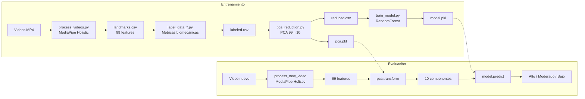

# Computer Vision-Based System for Gross Motor Skills Assessment

[](https://www.python.org/)
[](https://mediapipe.dev/)
[](https://scikit-learn.org/)
[](https://opencv.org/)
[](LICENSE)

Sistema de visión por computadora para la **evaluación automatizada de habilidades motoras gruesas** en niños con síndrome de Down. Analiza grabaciones de video de ejercicios físicos y clasifica el rendimiento en tres niveles (Alto, Moderado, Bajo) mediante detección de pose y aprendizaje automático.

> Proyecto de investigación de tesis — Universidad Católica de Santa María.

---

## Tabla de Contenidos

- [Descripción](#descripción)
- [Ejercicios Soportados](#ejercicios-soportados)
- [Arquitectura](#arquitectura)
- [Requisitos](#requisitos)
- [Instalación](#instalación)
- [Uso](#uso)
- [Pipeline de Entrenamiento](#pipeline-de-entrenamiento)
- [Pipeline de Evaluación](#pipeline-de-evaluación)
- [Resultados](#resultados)
- [Estructura del Proyecto](#estructura-del-proyecto)
- [API Reference](#api-reference)
- [Tests](#tests)
- [Documentación Adicional](#documentación-adicional)
- [Contacto](#contacto)

---

## Descripción

El sistema procesa videos de ejercicios motores gruesos a través de un pipeline de dos fases:

1. **Entrenamiento**: Extrae landmarks corporales de videos con MediaPipe, etiqueta el rendimiento con criterios biomecánicos específicos por ejercicio, reduce la dimensionalidad con PCA y entrena un clasificador.
2. **Evaluación**: Procesa un video nuevo, aplica la misma transformación PCA del entrenamiento y predice el rendimiento frame a frame.

### Stack Tecnológico

| Componente | Tecnología | Propósito |
|------------|-----------|-----------|
| Detección de pose | MediaPipe Holistic 0.10.5 | Extracción de 33 landmarks corporales por frame |
| Procesamiento de video | OpenCV | Lectura y conversión de frames |
| Reducción dimensional | PCA (scikit-learn) | Compresión de 99 features a 10 componentes |
| Clasificación | RandomForest (scikit-learn) | Clasificación de rendimiento en 3 niveles |
| Serialización | joblib | Persistencia de modelos y objetos PCA |
| Visualización | matplotlib + seaborn | Matrices de confusión |

---

## Ejercicios Soportados

| Ejercicio | Métricas Evaluadas | Pesos |
|-----------|--------------------|-------|
| **Salto** (jump) | Altura de tobillos | 100% |
| **Gateo** (crawl) | Coordinación diagonal, estabilidad de cadera, fluidez | 40% / 30% / 30% |
| **Sentarse** (sit) | Control postural, simetría corporal, suavidad de transiciones | 40% / 30% / 30% |
| **Lanzamiento** (throw) | Secuencia cinemática, amplitud de movimiento, estabilidad postural | 40% / 30% / 30% |

Cada frame se clasifica en:
- **1** — Alto rendimiento (top 33%)
- **2** — Rendimiento moderado (medio 34%)
- **3** — Bajo rendimiento (bottom 33%)

---

## Arquitectura



---

## Requisitos

- **Python** 3.9.6 o superior
- **RAM** 4 GB mínimo recomendado
- **Almacenamiento** 2 GB libres (videos + modelos)

---

## Instalación

```bash
# Clonar el repositorio
git clone https://github.com/HectorDaniell/proyectoTesis.git
cd proyectoTesis

# Crear y activar entorno virtual
python -m venv .venv

# Windows
.venv\Scripts\activate

# macOS / Linux
source .venv/bin/activate

# Instalar dependencias
pip install -r requirements.txt
```

---

## Uso

### Entrenar un modelo

```bash
cd src/training
python main_training.py
```

Por defecto entrena el ejercicio configurado en `main_training.py` (última línea). Para cambiar el ejercicio, modificar el argumento:

```python
main_training('jump')    # o 'crawl', 'sit', 'throw'
```

Los videos deben estar en `data/raw/{ejercicio}/` en formato MP4.

### Evaluar un video nuevo

```bash
cd src/evaluation
python main_evaluation.py
```

Configurar en `main_evaluation.py` las rutas al video, modelo y PCA:

```python
video_file = os.path.join(base_path, 'data/raw/throw/throw_009.mp4')
model_file = os.path.join(base_path, 'data/models/throw_model.pkl')
pca_file = os.path.join(base_path, 'data/processed/throw_pca.pkl')
```

---

## Pipeline de Entrenamiento

```
Videos MP4 ─► MediaPipe Holistic ─► Etiquetado biomecánico ─► PCA (99→10) ─► RandomForest
                33 landmarks          criterios por ejercicio    guarda .pkl    guarda .pkl
                × 3 coords            + clasificación 1/2/3
                = 99 features
```

**Pasos:**

1. **Extracción de landmarks** (`process_videos.py`) — MediaPipe Holistic detecta 33 puntos del cuerpo (x, y, z) en cada frame. Genera 99 features por frame.
2. **Etiquetado** (`label_data_*.py`) — Cada módulo calcula métricas biomecánicas específicas y clasifica el rendimiento usando percentiles (33/67).
3. **Reducción PCA** (`pca_reduction.py`) — Selecciona solo las 99 columnas de landmarks, aplica PCA con 10 componentes y guarda tanto el CSV reducido como el objeto PCA serializado (`.pkl`).
4. **Entrenamiento** (`train_model.py`) — Divide 80/20, entrena RandomForest (`n_estimators=100, class_weight='balanced'`), genera métricas y matriz de confusión, guarda el modelo como `.pkl`.

---

## Pipeline de Evaluación

```
Video MP4 ─► MediaPipe Holistic ─► pca.transform() ─► model.predict() ─► Resultado
               99 features          PCA entrenado       modelo entrenado    High/Moderate/Low
```

**Pasos:**

1. **Extracción de landmarks** (`predict_performance.py`) — Idéntica al entrenamiento: MediaPipe Holistic extrae 99 features por frame.
2. **Transformación PCA** — Carga el objeto PCA entrenado (`.pkl`) y aplica `pca.transform()` para proyectar sobre los mismos ejes del entrenamiento.
3. **Predicción** — Carga el modelo entrenado y predice la clase (1, 2 o 3) para cada frame.
4. **Resultado global** — Promedia las predicciones: ≤1.5 = High, ≤2.5 = Moderate, >2.5 = Low.

---

## Resultados

Resultados obtenidos con el ejercicio de salto (`jump`) sobre 1732 muestras de test:

| Modelo | Accuracy | Precision (avg) | Recall (avg) | F1 (avg) |
|--------|----------|-----------------|--------------|----------|
| **LogisticRegression** | **95.79%** | 0.96 | 0.96 | 0.96 |
| **RandomForest** | **95.55%** | 0.96 | 0.96 | 0.96 |
| SVM | 94.80% | 0.95 | 0.95 | 0.95 |
| kNN | 94.17% | 0.94 | 0.94 | 0.94 |
| GradientBoosting | 93.53% | 0.94 | 0.94 | 0.94 |

Split: 80% entrenamiento / 20% test, `random_state=42`.

---

## Estructura del Proyecto

```
proyectoTesis/
├── README.md                              # Este archivo
├── AGENTS.md                              # Guía técnica para desarrolladores e IAs
├── requirements.txt                       # Dependencias Python
├── .gitignore
│
├── src/
│   ├── training/                          # Pipeline de entrenamiento
│   │   ├── main_training.py              # Orquestador principal
│   │   ├── process_videos.py             # Extracción de landmarks (MediaPipe)
│   │   ├── label_data_jump.py            # Etiquetado: salto (altura tobillos)
│   │   ├── label_data_crawl.py           # Etiquetado: gateo (coordinación, estabilidad, fluidez)
│   │   ├── label_data_sit.py             # Etiquetado: sentarse (postura, simetría, transiciones)
│   │   ├── label_data_throw.py           # Etiquetado: lanzamiento (secuencia, amplitud, estabilidad)
│   │   ├── pca_reduction.py              # PCA: reducción 99→10 + persistencia del PCA
│   │   ├── train_model.py                # Entrenamiento y evaluación del modelo
│   │   └── compare_models.py             # Comparación de 5 algoritmos
│   │
│   └── evaluation/                        # Pipeline de evaluación
│       ├── main_evaluation.py             # Punto de entrada (configuración de rutas)
│       └── predict_performance.py         # Procesamiento + PCA + predicción
│
├── data/
│   ├── raw/                               # Videos MP4 por ejercicio
│   │   ├── jump/                          # Videos de salto
│   │   ├── crawl/                         # Videos de gateo
│   │   ├── sit/                           # Videos sentarse
│   │   └── throw/                         # Videos de Lanzamiento
│   ├── processed/                         # Datos procesados
│   │   ├── {exercise}_landmarks.csv       # Landmarks crudos (99 columnas)
│   │   ├── {exercise}_labeled.csv         # Landmarks + scores + performance
│   │   ├── {exercise}_reduced.csv         # PCA: PC1-PC10 + performance
│   │   └── {exercise}_pca.pkl             # Objeto PCA entrenado
│   ├── models/                            # Modelos serializados
│   │   └── {exercise}_model.pkl           # RandomForest entrenado
│   └── results/
│       ├── model_comparison.csv           # Comparativa de algoritmos
│       └── confusion_matrices/            # Matrices de confusión (PNG)
│
├── docs/
│   └── DOCUMENTATION.md                   # Documentación detallada del sistema de evaluación
│
├── Landmarks/                             # Utilidad auxiliar de visualización
│   ├── main.py                            # Visualización de landmarks en video
│   └── extract_landmarks.py              # Extracción a CSV (modo append)
│
└── test/
    └── test_exercise_modules.py           # Tests funcionales y de rendimiento
```

---

## API Reference

### Entrenamiento

#### `main_training(exercise_name)`
Orquesta el pipeline completo de entrenamiento para un ejercicio.

```python
from main_training import main_training
main_training('jump')  # 'jump' | 'crawl' | 'sit' | 'throw'
```

#### `process_video(video_path, exercise_name, combined_df) -> pd.DataFrame`
Extrae 33 landmarks (x, y, z) por frame usando MediaPipe Holistic. Retorna DataFrame con 99 columnas nombradas (`nose_x`, `nose_y`, ..., `right_foot_z`).

#### `label_performance_{exercise}(csv_file) -> str`
Calcula métricas biomecánicas y asigna etiquetas de rendimiento (1, 2, 3). Retorna ruta al CSV etiquetado.

#### `apply_pca(input_csv) -> str`
Aplica PCA(10) sobre las 99 columnas de landmarks. Guarda el objeto PCA como `{exercise}_pca.pkl` y retorna ruta al CSV reducido.

#### `train_and_evaluate_model(input_csv, exercise_name, model_name="RandomForest") -> tuple`
Entrena el modelo, genera métricas y matriz de confusión, guarda el modelo como `.pkl`. Retorna `(accuracy, classification_report)`.

### Evaluación

#### `predict_performance(video_path, model_path, pca_path)`
Pipeline completo de inferencia: procesa video, aplica PCA entrenado (`pca.transform`), predice con el modelo y muestra resultados por frame y promedio global.

#### `process_new_video(video_path) -> pd.DataFrame`
Extrae landmarks de un video nuevo. Idéntico a `process_video` pero sin nombres de columna.

#### `calculate_average_performance(predictions)`
Promedia predicciones numéricas y clasifica: ≤1.5 High, ≤2.5 Moderate, >2.5 Low.

---

## Tests

```bash
python test/test_exercise_modules.py
```

| Test | Tipo | Verificación |
|------|------|-------------|
| `test_model_validation` | Funcional | Accuracy ≥ 75%, Precision ≥ 70% |
| `test_input_output` | Funcional | Conteo de frames dentro de tolerancia ±10 |
| `test_performance` | No funcional | FPS ≥ 15, tiempo por frame ≤ 0.1s |
| `test_robustness` | No funcional | Manejo correcto de errores en video |

**Dependencias adicionales para tests:** `pytest`, `memory_profiler` (no incluidas en `requirements.txt`).

---

## Documentación Adicional

| Documento | Descripción |
|-----------|-------------|
| [`AGENTS.md`](AGENTS.md) | Guía técnica completa del proyecto: arquitectura, flujos, dependencias, formato de datos, módulos, problemas conocidos. Orientado a desarrolladores e IAs que tomen el proyecto. |
| [`docs/DOCUMENTATION.md`](docs/DOCUMENTATION.md) | Documentación detallada del sistema de evaluación con dos secciones: explicación en términos simples y explicación técnica con fórmulas biomecánicas por ejercicio. |

---

## Contacto

- **Email**: [hector.oviedo1312@gmail.com](mailto:hector.oviedo1312@gmail.com)
- **GitHub**: [HectorDaniell](https://github.com/HectorDaniell)

---

*Proyecto de investigación de tesis — Evaluación de habilidades motoras gruesas mediante visión por computadora para niños con síndrome de Down.*
